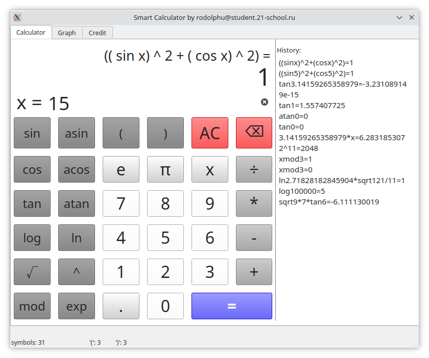
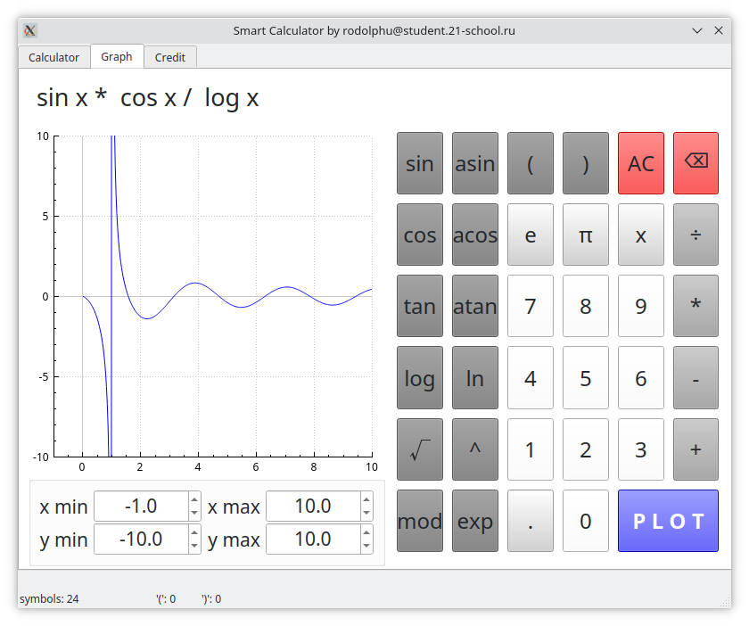
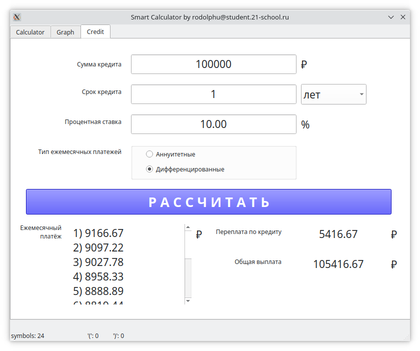

## SmartCalculatorCPP
Реализация калькулятора, имеющего три режима работы.

В первом режиме вычисляются выражения любой сложности, содержащие скобки, операторы, функции и переменную, значение которой указывается в соответствующем поле ввода.

Во втором режиме производится построение графика функции, заданной выражением.

Третий режим работы калькулятора - расчёт кредита.

 
 
 

### Реализация

- Программа разработана на языке C++ стандарта C++17;
- Код соответствует Google Style;
- Классы реализованы внутри пространства имен `smartcalc`;
- Подготовлено полное покрытие unit-тестами модулей, связанных с вычислением выражений, c помощью библиотеки GTest;
- Сборка программы настроена с помощью Makefile со стандартным набором целей для GNU-программ: all, install, uninstall, clean, dvi, dist, tests. Установка производится в каталог build в директории проекта;
- Запуск программы осуществляется с помощью команды `make start`;
- Графический пользовательский интерфейс реализован на базе GUI-библиотеки Qt;
- Программа реализована с использованием паттерна MVC с тонким контроллером;
- На вход программы могут подаваться как целые числа, так и вещественные числа, записанные и через точку, и в экспоненциальной форме записи;
- Вычисление производится после полного ввода вычисляемого выражения и нажатия на символ `=`;
- Вычисляются произвольные скобочные арифметические выражения в инфиксной нотации (возможна подстановка значения переменной _x_ в виде числа);
- Построение графика функций реализовано с использованием библиотеки qcustomplot.
- Возможно построение графика функции, заданной с помощью выражения в инфиксной нотации с переменной _x_  (с координатными осями, отметкой используемого масштаба и сеткой с адаптивным шагом);
- Для построения графиков функции необходимо дополнительно указывать отображаемые область определения и область значения;
- Проверяемая точность дробной части - минимум 7 знаков после запятой;
- У пользователя есть возможность ввода до 255 символов;
- Для перевода выражений в *обратную польскую нотацию* применяется *алгоритм Дейкстры*. 
- Скобочные арифметические выражения в инфиксной нотации поддерживают следующие арифметические операции и математические функции:
    - **Арифметические операторы**:

        | Название оператора | Инфиксная нотация   (Классическая) | Префиксная нотация   (Польская нотация) |  Постфиксная нотация   (Обратная польская нотация) |
        | ------ | ------ | ------ | ------ |
        | Скобки | (a + b) | (+ a b) | a b + |
        | Сложение | a + b | + a b | a b + |
        | Вычитание | a - b | - a b | a b - |
        | Умножение | a * b | * a b | a b * |
        | Деление | a / b | / a b | a b \ |
        | Возведение в степень | a ^ b | ^ a b | a b ^ |
        | Остаток от деления | a mod b | mod a b | a b mod |
        | Унарный плюс | +a | +a | a+ |
        | Унарный минус | -a | -a | a- |

    - **Функции**:
  
        | Описание функции | Функция |   
        | ---------------- | ------- |  
        | Вычисляет косинус | cos(x) |   
        | Вычисляет синус | sin(x) |  
        | Вычисляет тангенс | tan(x) |  
        | Вычисляет арккосинус | acos(x) | 
        | Вычисляет арксинус | asin(x) | 
        | Вычисляет арктангенс | atan(x) |
        | Вычисляет квадратный корень | sqrt(x) |
        | Вычисляет натуральный логарифм | ln(x) | 
        | Вычисляет десятичный логарифм | log(x) |

#### Кредитный калькулятор

 - Вход: общая сумма кредита, срок, процентная ставка, тип (аннуитетный, дифференцированный);
 - Выход: ежемесячный платеж, переплата по кредиту, общая выплата.

